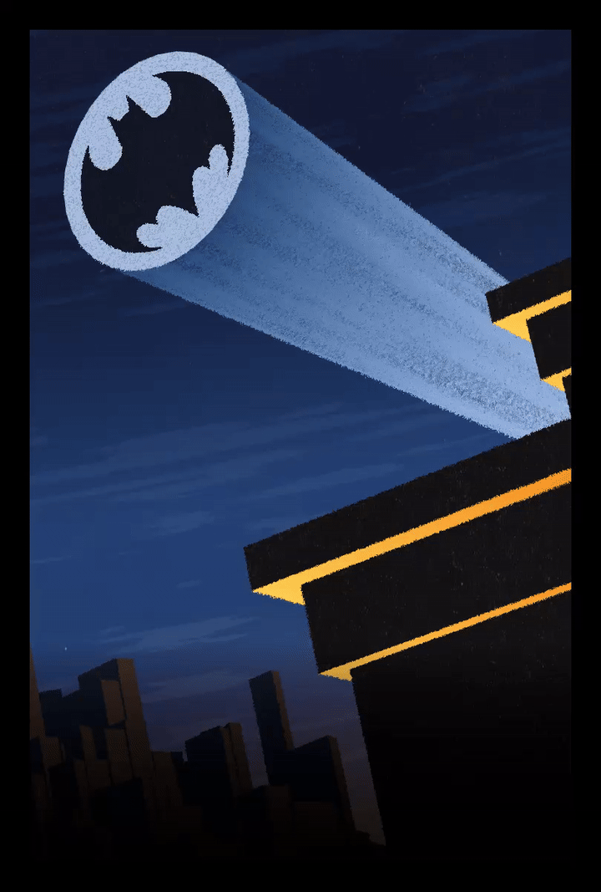
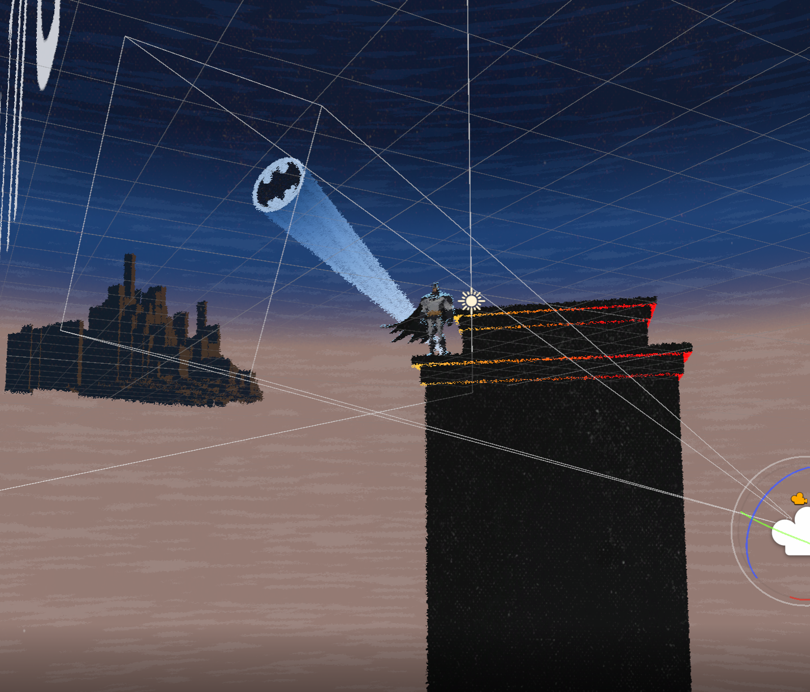
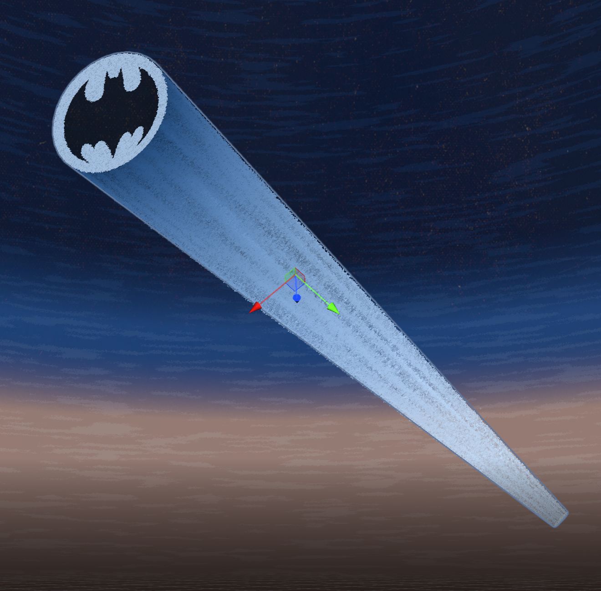
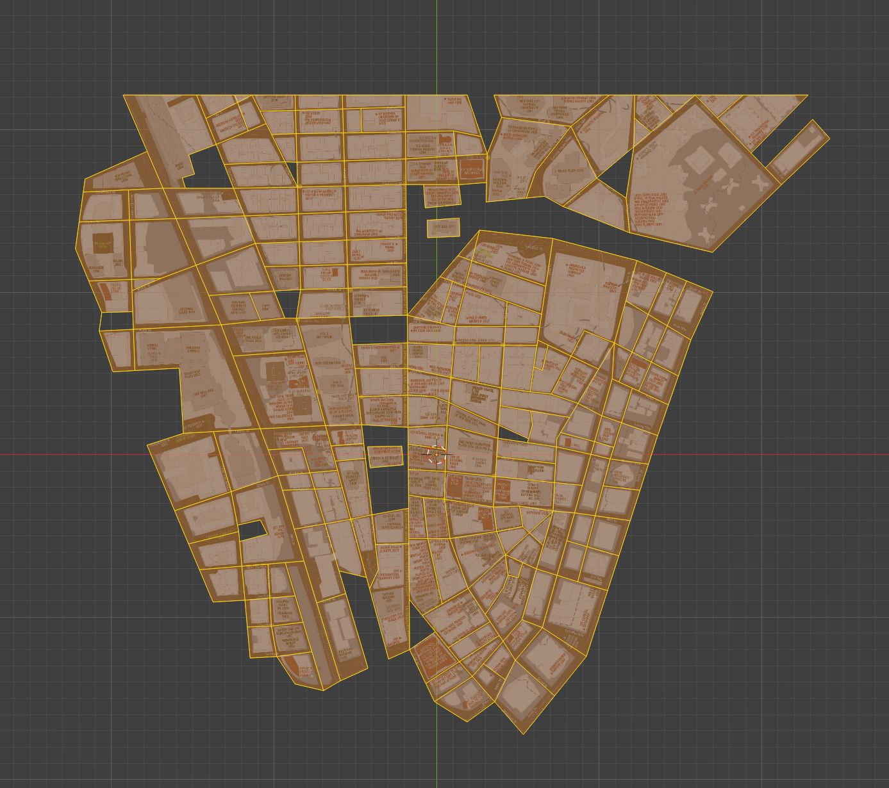
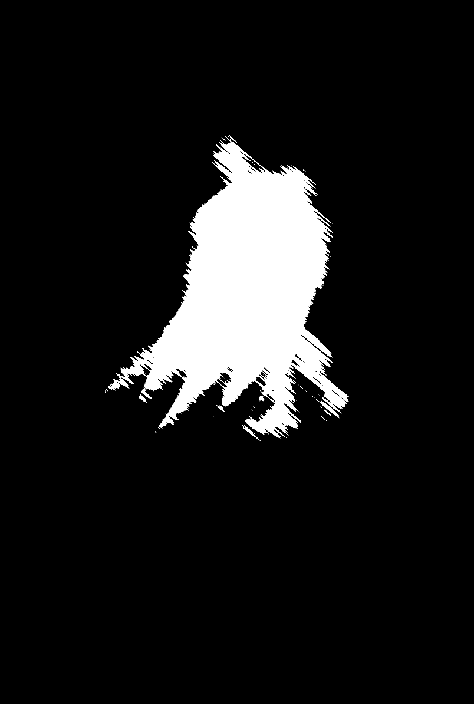
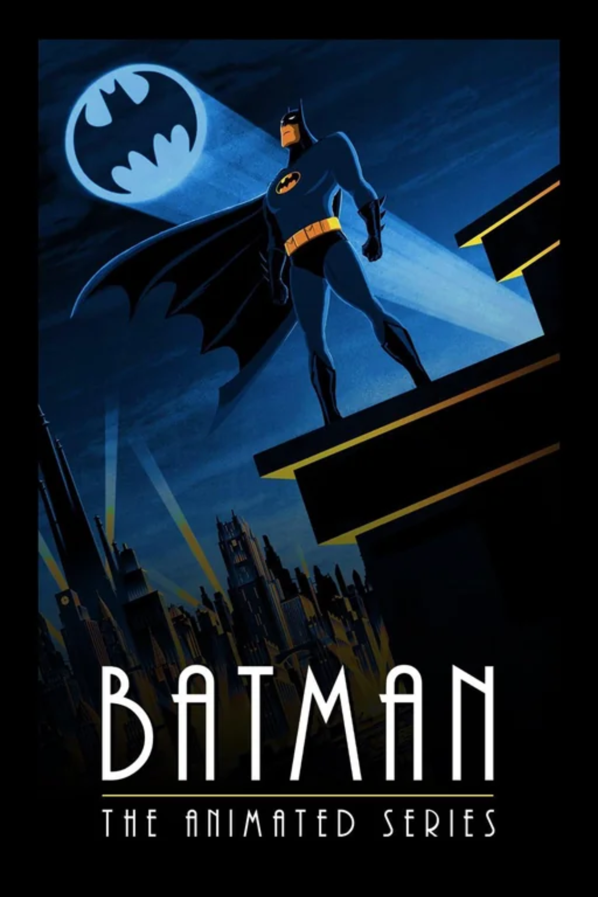
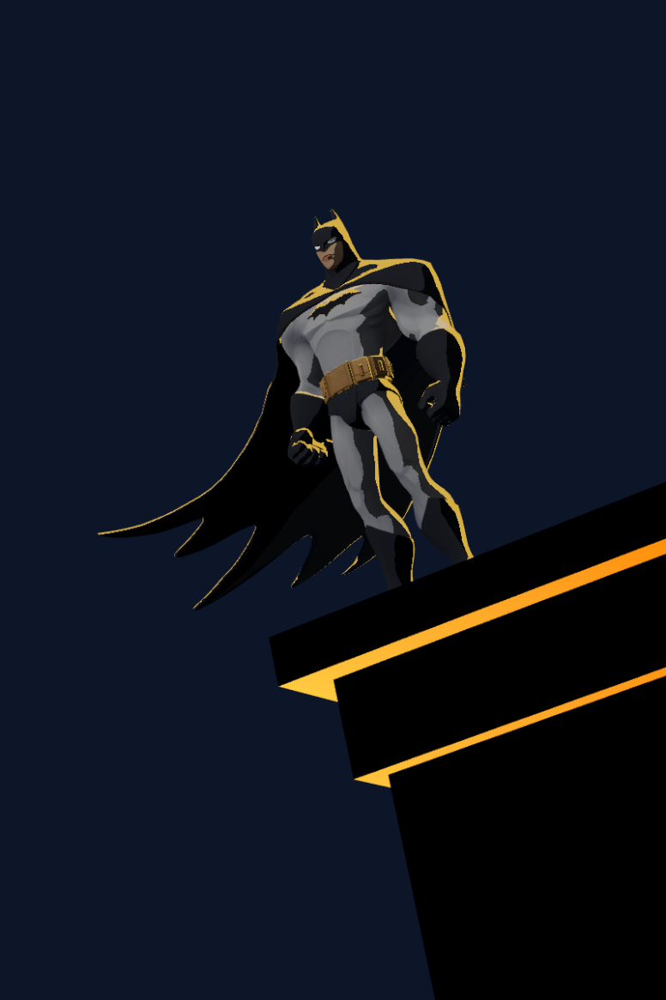
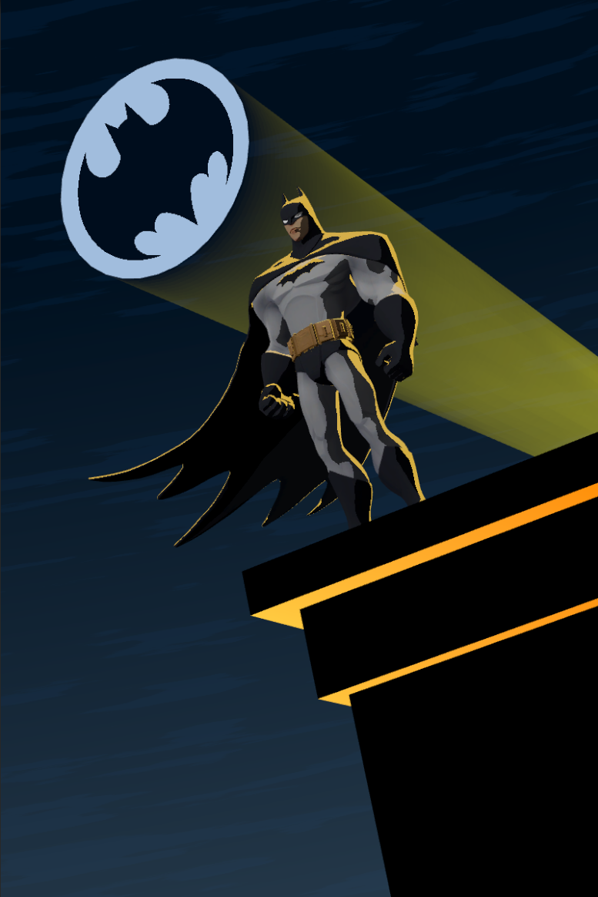
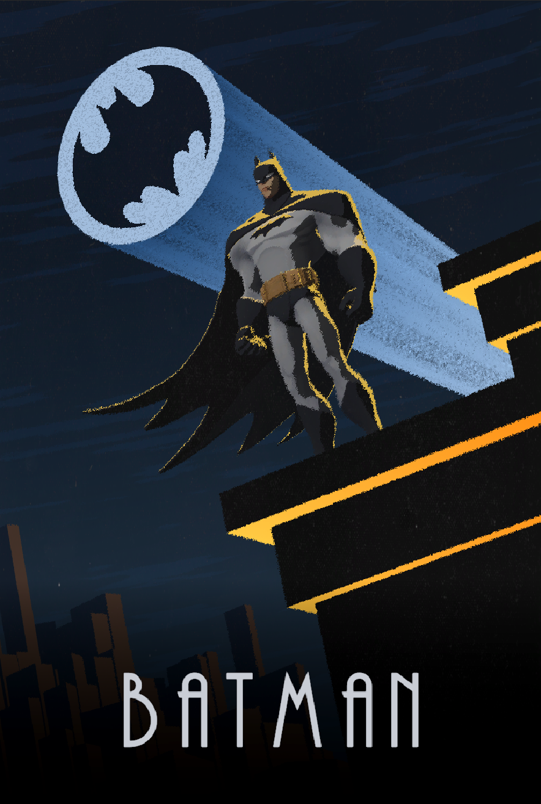
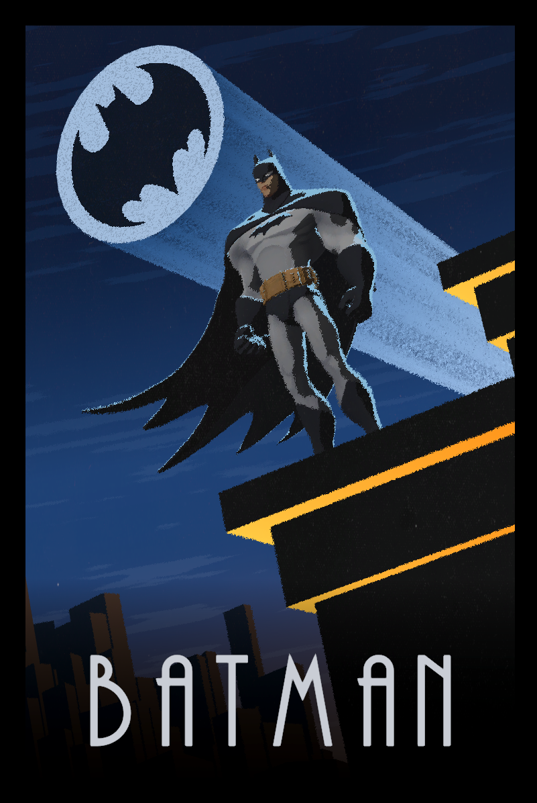

# Bat Summonings

  

## controls

Space to summon batman

## details

Model: https://sketchfab.com/3d-models/batman-multiversus-b6a84cca73f647ba8c86df799dd3eef3

All other aspects were created by me.

how the scene is laid out:

The bat signal is a tapered cylinder with backfaces rendered.

I modeled the city based on lower manhattan.

Used FBM noise and grungy textures for the stylization.

Created a procedural impact frame on summon.

  

Textures: 
https://texturelabs.org/textures/grunge_289/
https://texturelabs.org/textures/grunge_352/

## reference pic

## process pics

